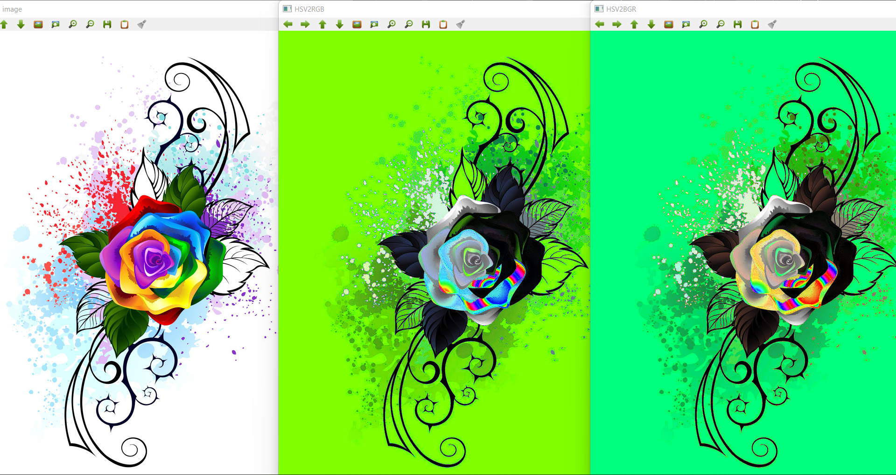

# Color Conversion
## AIM
To perform the color conversion between RGB, BGR, HSV, and YCbCr color models.

## SOFTWARE REQUIRED:
Anaconda - Python 3.7
## ALGORITHM:

### Step1:
Import cv2 and save and image as filename.jpg
<br>

### Step2:
Use imread(filename, flags) to read the file.
<br>

### Step3:
Use cv2.cvtColor(src, code, dst, dstCn) to convert an image from one color space to another.
<br>

### Step4:
Split and merge the image using cv2.split and cv2.merge commands.
<br>

### Step5:
End the program and close the output image windows.
<br>

## PROGRAM:
```
Developed By: Vaishnavi M
Register Number: 212221240058
```
### i) Convert BGR and RGB to HSV and GRAY

```
import cv2
house_color_image = cv2.imread('image.jpg')
cv2.imshow('Original image', house_color_image)
hsv_image = cv2.cvtColor(house_color_image, cv2.COLOR_BGR2HSV)
cv2.imshow('BGR2HSV' ,hsv_image )
gray_image1 = cv2.cvtColor (house_color_image, cv2.COLOR_RGB2GRAY)
cv2.imshow('RGB2GRAY', gray_image1)
cv2.waitKey(0)
cv2. destroyAllWindows()
```
### ii)Convert HSV to RGB and BGR
```
import cv2
house_color_image = cv2.imread('image.jpg')
cv2.imshow('Original image', house_color_image)
hsv_imagel = cv2.cvtColor(house_color_image, cv2.COLOR_HSV2RGB)
cv2.imshow('HSV2RGB' , hsv_imagel)
gray_image = cv2.cvtColor(house_color_image, cv2.COLOR_HSV2BGR)
cv2.imshow( 'HSV2BGR', gray_image)
cv2.waitKey(0)
cv2. destroyAllWindows()
```
### iii)Convert RGB and BGR to YCrCb
```
import cv2
house_color_image = cv2.imread('image.jpg')
cv2.imshow('Original image', house_color_image)
hsv_imagel = cv2.cvtColor(house_color_image, cv2.COLOR_RGB2YCrCb)
cv2.imshow('RGB2YCrCb' , hsv_imagel)
gray_image = cv2.cvtColor(house_color_image, cv2.COLOR_BGR2YCrCb)
cv2.imshow( 'BGR2YCrCb', gray_image)
cv2.waitKey(0)
cv2. destroyAllWindows()
```
### iv)Split and Merge RGB Image
```
import cv2
image = cv2.imread('image.jpg')
blue=image[:,:,0]
green=image[:,:,1]
red=image[:,:,2]
cv2.imshow('B-Channel',blue)
cv2.imshow('G-Channel',green)
cv2.imshow('R-Channel',red)
Merged_BGR=cv2.merge((blue,green,red))
cv2.imshow('Merged BGR Image',Merged_BGR)
cv2.waitKey(0)
cv2.destoryAllWindows()
```
### v) Split and merge HSV Image
```
import cv2
image = cv2.imread('image.jpg')
hsv = cv2.cvtColor(image, cv2.COLOR_BGR2HSV)
h,s,v = cv2.split(hsv)
cv2.imshow('Hue-Image',h)
cv2.imshow('Saturation-Image',s)
cv2.imshow('Gray-Image',v)
Merged_HSV = cv2.merge((h,s,v))
cv2.imshow('Merged HSV Image',Merged_HSV)
cv2.waitKey(0)
cv2.destoryAllWindows()
```
## OUTPUT :
### i) BGR and RGB to HSV and GRAY

<br>

### ii) HSV to RGB and BGR

<br>

### iii) RGB and BGR to YCrCb

<br>

### iv) Split and merge RGB Image


<br>

### v) Split and merge HSV Image


<br>


## RESULT:
Thus the color conversion was performed between RGB, HSV and YCbCr color models.
